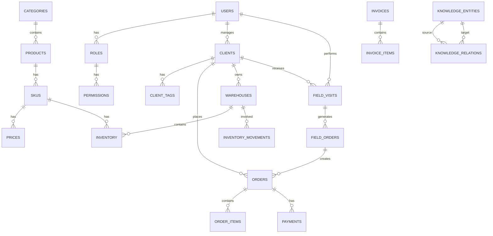

# Witsale 数据库设计

## 一、数据库技术选型

- **数据库**: PostgreSQL 15+
- **ORM**: SQLAlchemy 2.0 (异步)
- **数据迁移**: Alembic
- **连接池**: SQLAlchemy Connection Pool

---

## 二、核心表结构设计

### 2.1 用户相关表

#### `users` 表
| 字段名 | 数据类型 | 约束 | 描述 |
|--------|---------|------|------|
| `id` | `UUID` | `PRIMARY KEY` | 用户ID |
| `username` | `VARCHAR(255)` | `UNIQUE NOT NULL` | 用户名 |
| `email` | `VARCHAR(255)` | `UNIQUE NOT NULL` | 邮箱 |
| `password_hash` | `VARCHAR(255)` | `NOT NULL` | 密码哈希 |
| `full_name` | `VARCHAR(255)` | `NOT NULL` | 姓名 |
| `role_id` | `UUID` | `REFERENCES roles(id)` | 角色ID |
| `client_id` | `UUID` | `REFERENCES clients(id)` | 客户ID（可选） |
| `is_active` | `BOOLEAN` | `DEFAULT TRUE` | 是否激活 |
| `created_at` | `TIMESTAMP` | `DEFAULT NOW()` | 创建时间 |
| `updated_at` | `TIMESTAMP` | `DEFAULT NOW()` | 更新时间 |

#### `roles` 表
| 字段名 | 数据类型 | 约束 | 描述 |
|--------|---------|------|------|
| `id` | `UUID` | `PRIMARY KEY` | 角色ID |
| `name` | `VARCHAR(50)` | `UNIQUE NOT NULL` | 角色名称 |
| `description` | `TEXT` | | 角色描述 |
| `created_at` | `TIMESTAMP` | `DEFAULT NOW()` | 创建时间 |

#### `permissions` 表
| 字段名 | 数据类型 | 约束 | 描述 |
|--------|---------|------|------|
| `id` | `UUID` | `PRIMARY KEY` | 权限ID |
| `name` | `VARCHAR(50)` | `UNIQUE NOT NULL` | 权限名称 |
| `description` | `TEXT` | | 权限描述 |

#### `role_permissions` 表
| 字段名 | 数据类型 | 约束 | 描述 |
|--------|---------|------|------|
| `role_id` | `UUID` | `REFERENCES roles(id)` | 角色ID |
| `permission_id` | `UUID` | `REFERENCES permissions(id)` | 权限ID |
| `PRIMARY KEY` | | `(role_id, permission_id)` | 复合主键 |

### 2.2 客户相关表

#### `clients` 表
| 字段名 | 数据类型 | 约束 | 描述 |
|--------|---------|------|------|
| `id` | `UUID` | `PRIMARY KEY` | 客户ID |
| `name` | `VARCHAR(255)` | `NOT NULL` | 客户名称 |
| `client_type` | `VARCHAR(20)` | `NOT NULL` | 客户类型（渠道/终端/个人） |
| `contact_name` | `VARCHAR(255)` | | 联系人姓名 |
| `contact_phone` | `VARCHAR(20)` | | 联系电话 |
| `contact_email` | `VARCHAR(255)` | | 联系邮箱 |
| `address` | `TEXT` | | 地址 |
| `status` | `VARCHAR(20)` | `DEFAULT 'active'` | 状态 |
| `created_at` | `TIMESTAMP` | `DEFAULT NOW()` | 创建时间 |
| `updated_at` | `TIMESTAMP` | `DEFAULT NOW()` | 更新时间 |

#### `client_tags` 表
| 字段名 | 数据类型 | 约束 | 描述 |
|--------|---------|------|------|
| `id` | `UUID` | `PRIMARY KEY` | 标签ID |
| `name` | `VARCHAR(50)` | `UNIQUE NOT NULL` | 标签名称 |
| `description` | `TEXT` | | 标签描述 |

#### `client_tag_associations` 表
| 字段名 | 数据类型 | 约束 | 描述 |
|--------|---------|------|------|
| `client_id` | `UUID` | `REFERENCES clients(id)` | 客户ID |
| `tag_id` | `UUID` | `REFERENCES client_tags(id)` | 标签ID |
| `PRIMARY KEY` | | `(client_id, tag_id)` | 复合主键 |

### 2.3 商品相关表

#### `categories` 表
| 字段名 | 数据类型 | 约束 | 描述 |
|--------|---------|------|------|
| `id` | `UUID` | `PRIMARY KEY` | 分类ID |
| `name` | `VARCHAR(100)` | `NOT NULL` | 分类名称 |
| `parent_id` | `UUID` | `REFERENCES categories(id)` | 父分类ID |
| `level` | `INTEGER` | `DEFAULT 1` | 分类级别 |
| `sort_order` | `INTEGER` | `DEFAULT 0` | 排序顺序 |

#### `products` 表
| 字段名 | 数据类型 | 约束 | 描述 |
|--------|---------|------|------|
| `id` | `UUID` | `PRIMARY KEY` | 商品ID |
| `name` | `VARCHAR(255)` | `NOT NULL` | 商品名称 |
| `category_id` | `UUID` | `REFERENCES categories(id)` | 分类ID |
| `description` | `TEXT` | | 商品描述 |
| `specs` | `JSONB` | | 商品规格（JSON格式） |
| `attributes` | `JSONB` | | 商品属性（JSON格式） |
| `status` | `VARCHAR(20)` | `DEFAULT 'active'` | 状态 |
| `created_at` | `TIMESTAMP` | `DEFAULT NOW()` | 创建时间 |
| `updated_at` | `TIMESTAMP` | `DEFAULT NOW()` | 更新时间 |

#### `skus` 表
| 字段名 | 数据类型 | 约束 | 描述 |
|--------|---------|------|------|
| `id` | `UUID` | `PRIMARY KEY` | SKU ID |
| `product_id` | `UUID` | `REFERENCES products(id)` | 商品ID |
| `sku_code` | `VARCHAR(100)` | `UNIQUE NOT NULL` | SKU编码 |
| `name` | `VARCHAR(255)` | `NOT NULL` | SKU名称 |
| `attributes` | `JSONB` | | SKU属性（JSON格式） |
| `barcode` | `VARCHAR(50)` | | 条形码 |
| `status` | `VARCHAR(20)` | `DEFAULT 'active'` | 状态 |

#### `prices` 表
| 字段名 | 数据类型 | 约束 | 描述 |
|--------|---------|------|------|
| `id` | `UUID` | `PRIMARY KEY` | 价格ID |
| `sku_id` | `UUID` | `REFERENCES skus(id)` | SKU ID |
| `price_type` | `VARCHAR(20)` | `NOT NULL` | 价格类型（企业/渠道/终端/个人） |
| `price` | `DECIMAL(10,2)` | `NOT NULL` | 价格 |
| `effective_date` | `DATE` | `DEFAULT NOW()` | 生效日期 |
| `expiry_date` | `DATE` | | 过期日期 |

### 2.4 库存相关表

#### `warehouses` 表
| 字段名 | 数据类型 | 约束 | 描述 |
|--------|---------|------|------|
| `id` | `UUID` | `PRIMARY KEY` | 仓库ID |
| `name` | `VARCHAR(255)` | `NOT NULL` | 仓库名称 |
| `type` | `VARCHAR(20)` | `NOT NULL` | 仓库类型（企业/渠道/终端） |
| `client_id` | `UUID` | `REFERENCES clients(id)` | 客户ID（渠道/终端仓库） |
| `address` | `TEXT` | | 仓库地址 |
| `contact` | `VARCHAR(255)` | | 联系人 |
| `phone` | `VARCHAR(20)` | | 联系电话 |
| `status` | `VARCHAR(20)` | `DEFAULT 'active'` | 状态 |

#### `inventory` 表
| 字段名 | 数据类型 | 约束 | 描述 |
|--------|---------|------|------|
| `id` | `UUID` | `PRIMARY KEY` | 库存ID |
| `sku_id` | `UUID` | `REFERENCES skus(id)` | SKU ID |
| `warehouse_id` | `UUID` | `REFERENCES warehouses(id)` | 仓库ID |
| `quantity` | `INTEGER` | `DEFAULT 0` | 库存数量 |
| `reserved_quantity` | `INTEGER` | `DEFAULT 0` | 已预留数量 |
| `updated_at` | `TIMESTAMP` | `DEFAULT NOW()` | 更新时间 |
| `UNIQUE` | | `(sku_id, warehouse_id)` | 唯一约束 |

#### `inventory_movements` 表
| 字段名 | 数据类型 | 约束 | 描述 |
|--------|---------|------|------|
| `id` | `UUID` | `PRIMARY KEY` | 移动ID |
| `sku_id` | `UUID` | `REFERENCES skus(id)` | SKU ID |
| `from_warehouse_id` | `UUID` | `REFERENCES warehouses(id)` | 源仓库ID |
| `to_warehouse_id` | `UUID` | `REFERENCES warehouses(id)` | 目标仓库ID |
| `quantity` | `INTEGER` | `NOT NULL` | 移动数量 |
| `type` | `VARCHAR(20)` | `NOT NULL` | 移动类型（入库/出库/调拨） |
| `reference_id` | `UUID` | | 参考ID（如订单ID） |
| `created_at` | `TIMESTAMP` | `DEFAULT NOW()` | 创建时间 |

### 2.5 订单相关表

#### `orders` 表 (分区表)
| 字段名 | 数据类型 | 约束 | 描述 |
|--------|---------|------|------|
| `id` | `UUID` | `PRIMARY KEY` | 订单ID |
| `order_number` | `VARCHAR(50)` | `UNIQUE NOT NULL` | 订单号 |
| `client_id` | `UUID` | `REFERENCES clients(id)` | 客户ID |
| `user_id` | `UUID` | `REFERENCES users(id)` | 下单用户ID |
| `total_amount` | `DECIMAL(10,2)` | `NOT NULL` | 总金额 |
| `status` | `VARCHAR(20)` | `DEFAULT 'pending'` | 订单状态 |
| `payment_method` | `VARCHAR(20)` | | 支付方式 |
| `payment_status` | `VARCHAR(20)` | `DEFAULT 'unpaid'` | 支付状态 |
| `delivery_address` | `TEXT` | | 配送地址 |
| `notes` | `TEXT` | | 备注 |
| `created_at` | `TIMESTAMP` | `DEFAULT NOW()` | 创建时间 |
| `updated_at` | `TIMESTAMP` | `DEFAULT NOW()` | 更新时间 |

#### `order_items` 表
| 字段名 | 数据类型 | 约束 | 描述 |
|--------|---------|------|------|
| `id` | `UUID` | `PRIMARY KEY` | 订单项ID |
| `order_id` | `UUID` | `REFERENCES orders(id)` | 订单ID |
| `sku_id` | `UUID` | `REFERENCES skus(id)` | SKU ID |
| `quantity` | `INTEGER` | `NOT NULL` | 数量 |
| `unit_price` | `DECIMAL(10,2)` | `NOT NULL` | 单价 |
| `subtotal` | `DECIMAL(10,2)` | `NOT NULL` | 小计 |

#### `payments` 表
| 字段名 | 数据类型 | 约束 | 描述 |
|--------|---------|------|------|
| `id` | `UUID` | `PRIMARY KEY` | 支付ID |
| `order_id` | `UUID` | `REFERENCES orders(id)` | 订单ID |
| `amount` | `DECIMAL(10,2)` | `NOT NULL` | 支付金额 |
| `payment_method` | `VARCHAR(20)` | `NOT NULL` | 支付方式 |
| `transaction_id` | `VARCHAR(100)` | | 交易ID |
| `status` | `VARCHAR(20)` | `DEFAULT 'pending'` | 支付状态 |
| `created_at` | `TIMESTAMP` | `DEFAULT NOW()` | 创建时间 |

### 2.6 财务相关表

#### `invoices` 表
| 字段名 | 数据类型 | 约束 | 描述 |
|--------|---------|------|------|
| `id` | `UUID` | `PRIMARY KEY` | 发票ID |
| `invoice_number` | `VARCHAR(50)` | `UNIQUE NOT NULL` | 发票号 |
| `client_id` | `UUID` | `REFERENCES clients(id)` | 客户ID |
| `amount` | `DECIMAL(10,2)` | `NOT NULL` | 金额 |
| `status` | `VARCHAR(20)` | `DEFAULT 'unpaid'` | 状态 |
| `issue_date` | `DATE` | `DEFAULT NOW()` | 开票日期 |
| `due_date` | `DATE` | | 到期日期 |

#### `invoice_items` 表
| 字段名 | 数据类型 | 约束 | 描述 |
|--------|---------|------|------|
| `id` | `UUID` | `PRIMARY KEY` | 发票项ID |
| `invoice_id` | `UUID` | `REFERENCES invoices(id)` | 发票ID |
| `description` | `TEXT` | `NOT NULL` | 描述 |
| `quantity` | `INTEGER` | `NOT NULL` | 数量 |
| `unit_price` | `DECIMAL(10,2)` | `NOT NULL` | 单价 |
| `subtotal` | `DECIMAL(10,2)` | `NOT NULL` | 小计 |

### 2.7 外勤相关表

#### `field_visits` 表
| 字段名 | 数据类型 | 约束 | 描述 |
|--------|---------|------|------|
| `id` | `UUID` | `PRIMARY KEY` | 拜访ID |
| `user_id` | `UUID` | `REFERENCES users(id)` | 外勤人员ID |
| `client_id` | `UUID` | `REFERENCES clients(id)` | 客户ID |
| `visit_date` | `DATE` | `DEFAULT NOW()` | 拜访日期 |
| `start_time` | `TIMESTAMP` | | 开始时间 |
| `end_time` | `TIMESTAMP` | | 结束时间 |
| `location` | `POINT` | | 拜访位置（PostGIS） |
| `notes` | `TEXT` | | 拜访记录 |
| `status` | `VARCHAR(20)` | `DEFAULT 'completed'` | 状态 |

#### `field_orders` 表
| 字段名 | 数据类型 | 约束 | 描述 |
|--------|---------|------|------|
| `id` | `UUID` | `PRIMARY KEY` | 现场订单ID |
| `visit_id` | `UUID` | `REFERENCES field_visits(id)` | 拜访ID |
| `order_id` | `UUID` | `REFERENCES orders(id)` | 订单ID |
| `created_at` | `TIMESTAMP` | `DEFAULT NOW()` | 创建时间 |

### 2.8 知识图谱相关表

#### `knowledge_entities` 表
| 字段名 | 数据类型 | 约束 | 描述 |
|--------|---------|------|------|
| `id` | `UUID` | `PRIMARY KEY` | 实体ID |
| `type` | `VARCHAR(50)` | `NOT NULL` | 实体类型 |
| `name` | `VARCHAR(255)` | `NOT NULL` | 实体名称 |
| `properties` | `JSONB` | | 实体属性 |
| `created_at` | `TIMESTAMP` | `DEFAULT NOW()` | 创建时间 |

#### `knowledge_relations` 表
| 字段名 | 数据类型 | 约束 | 描述 |
|--------|---------|------|------|
| `id` | `UUID` | `PRIMARY KEY` | 关系ID |
| `source_id` | `UUID` | `REFERENCES knowledge_entities(id)` | 源实体ID |
| `target_id` | `UUID` | `REFERENCES knowledge_entities(id)` | 目标实体ID |
| `relation_type` | `VARCHAR(50)` | `NOT NULL` | 关系类型 |
| `properties` | `JSONB` | | 关系属性 |
| `created_at` | `TIMESTAMP` | `DEFAULT NOW()` | 创建时间 |

---

## 三、实体关系图 (ERD)

---

## 四、索引策略

### 4.1 主键索引
- 所有表的主键字段自动创建索引

### 4.2 外键索引
- 所有外键字段创建索引
- 例如：`users.role_id`, `orders.client_id`

### 4.3 唯一索引
- 唯一约束字段创建索引
- 例如：`users.username`, `skus.sku_code`

### 4.4 复合索引
- 常用查询组合字段创建复合索引
- 例如：`inventory(sku_id, warehouse_id)`
- 例如：`prices(sku_id, price_type)`

### 4.5 部分索引
- 针对频繁查询的状态字段创建部分索引
- 例如：`orders(status) WHERE status = 'pending'`

### 4.6 全文搜索索引
- 商品名称和描述创建全文搜索索引
- 使用PostgreSQL的`tsvector`类型

---

## 五、分区方案

### 5.1 订单表分区
- **按时间分区**：按年/月分区
- **分区键**：`created_at`
- **优势**：提高查询性能，便于数据归档

### 5.2 库存变动表分区
- **按时间分区**：按年/月分区
- **分区键**：`created_at`
- **优势**：管理大量历史数据

### 5.3 财务表分区
- **按时间分区**：按年/月分区
- **分区键**：`issue_date`或`created_at`

---

## 六、PostgreSQL 特殊特性应用

### 6.1 JSONB 类型
- 商品规格和属性
- 客户扩展信息
- 知识图谱实体和关系属性

### 6.2 Array 类型
- 商品标签
- 客户标签
- 权限列表

### 6.3 Range Types
- 价格生效时间范围
- 订单时间范围

### 6.4 Point 类型 (PostGIS)
- 外勤拜访位置
- 仓库位置

### 6.5 CTE (Common Table Expressions)
- 复杂报表查询
- 递归查询（如商品分类树）

### 6.6 Window Functions
- 销售排名
- 移动平均值

### 6.7 Materialized Views
- 常用报表数据预计算
- 减轻查询负担

---

## 七、数据迁移方案

### 7.1 Alembic 配置
- 使用Alembic进行数据库迁移
- 迁移文件版本控制
- 支持回滚操作

### 7.2 迁移策略
- 开发环境：自动迁移
- 测试环境：手动审核后迁移
- 生产环境：严格审核后迁移

### 7.3 初始数据
- 基础角色和权限
- 系统默认配置
- 初始商品分类

---

## 八、备份与恢复策略

### 8.1 备份策略
- **全量备份**：每日一次
- **增量备份**：每小时一次
- **WAL日志**：实时备份

### 8.2 恢复策略
- 测试环境定期恢复测试
- 制定详细的恢复流程
- 备份异地存储

---

## 九、性能优化建议

1. **连接池配置**：合理设置连接池大小
2. **查询优化**：使用EXPLAIN分析查询计划
3. **真空清理**：定期运行VACUUM
4. **统计信息更新**：定期运行ANALYZE
5. **监控**：使用PostgreSQL监控工具

---

*Last updated: 2026-03-18*
